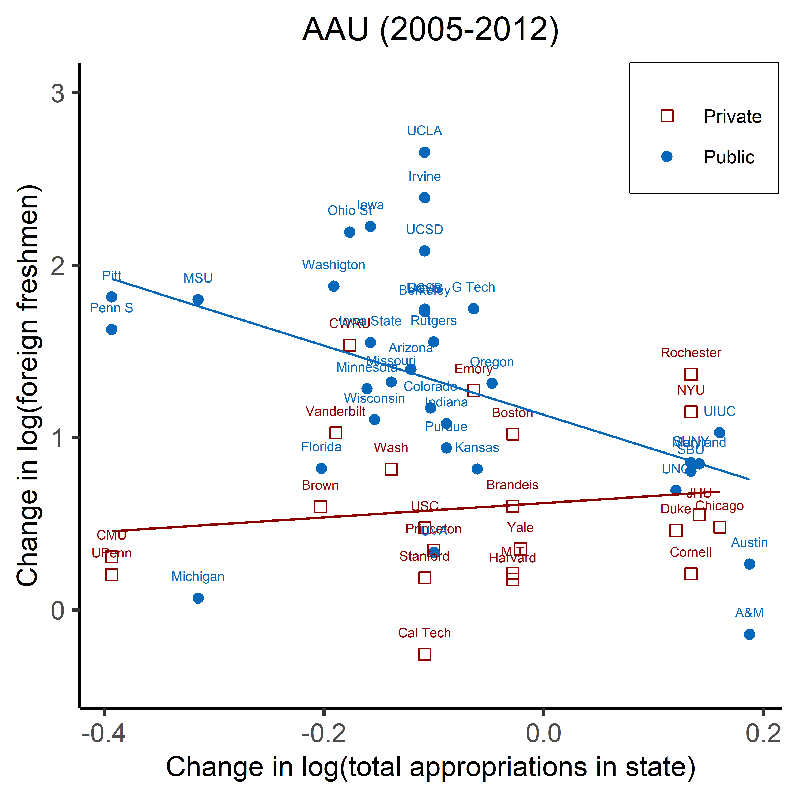

\newpage

# LOAD LIBRARIES

```{r, eval = FALSE}
library(tidyverse)
library(dplyr)
library(tidyr)
library(rio)
library(knitr)
library(ggplot2)
library(ggthemes)
```

# EXERCISE 1: REPLICATE FIGURE 4
## Load the dataset

```{r}
data_original <- rio::import("data/pub_pvt_scatters.dta")
uniid <- rio::import("data/univ_names.xlsx")
```

## Merge data

- Steps:

    + When we merge 2 data frames we only keep obs of common university ID
    + We reorder the columns for better view

- Command: 

```{r}
df <- merge(data_original, uniid, by="unitid", all = FALSE)
```


```{r}
df <- dplyr::relocate(df, name, .after = unitid)
```

## Create a common deflator

```{r, warning=FALSE, message = FALSE}
library(dplyr)
df <- df %>%
  group_by(year) %>%
  mutate(cpi_all = mean(cpi, na.rm = TRUE))
```

## Create the real value of the appropriation

```{r}
df$real_approp <- df$nominal_approp / df$cpi_all
```

## Differentiate public and private university

```{r}
df$Private <- as.factor(df$Private)
```

```{r, eval=FALSE}
class(df$Private)
```

## Reorder data by unit and by year

```{r}
df <- df %>% dplyr::arrange(unitid, year)
```

## Create log of variable

```{r}
df <- df %>%
  mutate(log_real_approp = log(real_approp))
df <- df %>%
  mutate(log_foreign_freshmen = log(ENROLL_FRESH_NON_RES_ALIEN_DEG))
```

## Create difference in log values by university between 2005 and 2012

- We first create 2 temporary data frames, one for log_real_approp and another for log_foreign_freshmen

```{r}
tmp1 <- df %>% 
  select(name, year, log_real_approp) %>%
  filter(year == 2005 | year == 2012)
tmp2 <- df %>%
  select(name, year, log_foreign_freshmen) %>%
  filter(year == 2005 | year == 2012)
```

- Calculate the difference between 2005 and 2012 for log_real_approp

```{r}
tmp1 <- tmp1 %>%
  tidyr::spread(key = "year", value = "log_real_approp")
tmp1 <- as.data.frame(tmp1)
tmp1$change_logreal <- tmp1$`2012` - tmp1$`2005`
tmp1 <- tmp1 %>%
  select(name, change_logreal)
```

- Calculate the difference between 2005 and 2012 for log_foreign_freshmen

```{r}
tmp2 <- tmp2 %>%
  tidyr::spread(key = "year", value = "log_foreign_freshmen")
tmp2 <- as.data.frame(tmp2)
tmp2$change_logforeign <- tmp2$`2012`-tmp2$`2005`
tmp2 <- tmp2 %>%
  select(name, change_logforeign)
```

- Create a data frame for the school type (whether private or public)

```{r}
tmp3 <- df %>%
  as.data.frame() %>%
  select(name, Private) %>%
  distinct()
```

- Create data frame for figure 4

```{r}
df_fig4 <- merge(x = tmp1, y = tmp2, by = "name")
df_fig4 <- merge(x = df_fig4, y = tmp3, by = "name")
df_fig4$Private <- as.integer(df_fig4$Private)
df_fig4$Private[df_fig4$Private == 1] <- "Public"
df_fig4$Private[df_fig4$Private == 2] <- "Private"
```

## Replicate Figure 4

```{r, warning=FALSE, eval=FALSE}
library(ggplot2)
png(filename = "figure4.png", unit = "cm", width = 12, height = 12, res = 800)

ggplot(data = df_fig4, aes(x  = change_logreal, y = change_logforeign, color = Private, shape = Private)) +
  geom_point(size = 2) +
  scale_color_manual(values = c("darkred","#0567B9")) +
  scale_shape_manual(values = c(0,16)) +
  geom_text(label = df_fig4$name, size = 2, vjust = 0, nudge_y = 0.1, show.legend = FALSE) +
  geom_smooth(method = "lm", formula = "y ~ x", se = FALSE, show.legend = FALSE, size=0.5) +
  ylim (-0.4,3) +
  labs(x = "Change in log(total appropriations in state)",
       y = "Change in log(foreign freshmen)") +
  theme_classic(base_size = 14) +
  ggtitle("AAU (2005-2012)") +
  theme(plot.title = element_text(hjust = 0.5, size = 14)) +
  theme(axis.title = element_text(size = 12)) +
  theme(legend.text = element_text(size = 8), legend.title = element_blank(), legend.position = c(0.89,0.9), legend.box.background = element_rect(fill = "white", color = "black"))

dev.off()
```



# EXERCISE 2: REPLICATE TABLE 2

## Load the dataset

```{r}
unidata <- rio::import("data/univ_data.dta")
```

## Create variable for total state appropriation of all other universities within the same state

```{r}
unidata$total_state_ap <- unidata$nominal_approp - unidata$state_ap*100000
unidata$l_total_state_ap <- log(unidata$total_state_ap)
```

## Find the balanced sample

```{r, warning=FALSE, message=FALSE}
library(tidyr)
balanced <- unidata %>% 
  drop_na(ENROLL_FRESH_NON_RES_ALIEN_DEG, AMERICAN_OOS, IN_STATE_FRESHMEN)
```

## Run the regression from table 2

* Load library **lfe** and **stargazer**

```{r, warning=FALSE, message=FALSE}
library(lfe)
library(stargazer)
```

* Create data frame for each group: research, AAU and nonResearch

```{r}
research <- balanced %>% filter(Research == 1)
nonResearch <- balanced %>% filter(nonResearch == 1)
AAU <- balanced %>% filter(AAU == 1)
```

* Run **OLS** regression

```{r}
research_ols <- felm(l_ENROLL_FRESH_NON_RES_ALIEN_DEG ~ l_state_ap + l_population | unitid + year | 0 | unitid, data = research, weights = research$weight)

nonResearch_ols <- felm(l_ENROLL_FRESH_NON_RES_ALIEN_DEG ~ l_state_ap + l_population | unitid + year | 0 | unitid, data = nonResearch, weights = nonResearch$weight)

AAU_ols <- felm(l_ENROLL_FRESH_NON_RES_ALIEN_DEG ~ l_state_ap + l_population | unitid + year | 0 | unitid, data = AAU, weights = AAU$weight)

```

* Run **1st stage** regression

```{r}
research_1st <- felm(l_state_ap ~ l_total_state_ap | unitid + year | 0 | state_of_college, data = research)

nonResearch_1st <- felm(l_state_ap ~ l_total_state_ap | unitid + year | 0 | state_of_college, data = nonResearch, weights = nonResearch$weight)

AAU_1st <- felm(l_state_ap ~ l_total_state_ap | unitid + year | 0 | state_of_college, data = AAU, weights = AAU$weight)
```

* Run **2nd stage** regression

```{r}
research_iv <- felm(l_ENROLL_FRESH_NON_RES_ALIEN_DEG ~ l_population | unitid + year | (l_state_ap ~ l_total_state_ap) | state_of_college, data = research, weights = research$weight)

nonResearch_iv <- felm(l_ENROLL_FRESH_NON_RES_ALIEN_DEG ~ l_population | unitid + year | (l_state_ap ~ l_total_state_ap) | state_of_college, data = nonResearch, weights = nonResearch$weight)

AAU_iv <- felm(l_ENROLL_FRESH_NON_RES_ALIEN_DEG ~ l_population | unitid + year | (l_state_ap ~ l_total_state_ap) | state_of_college, data = AAU, weights = AAU$weight)
```

## Arrange regression result onto the table

* Table for **1st stage** regression

```{r, eval=FALSE}
stargazer(research_1st, AAU_1st, nonResearch_1st, 
          title = "TABLE 2.b - EFFECTS OF LN(STATE APPROPRIATIONS) ON LN(FIRST-YEAR FOREIGN ENROLLMENT), 1996-2012", 
          dep.var.labels = c("ln(state appropriation)"),
          covariate.labels = c("ln(appropriation_other in state)"),
          omit.stat = c("LL", "f", "ser", "adj.rsq","n"),
          no.space = TRUE,
          align = TRUE, 
          type = 'html',
          out =  "1ststage.html")
```


* Table for **OLS** and **2nd stage** regression

```{r, eval=FALSE}
stargazer(research_1st, AAU_1st, nonResearch_1st, 
          title = "TABLE 2.b - EFFECTS OF LN(STATE APPROPRIATIONS) ON LN(FIRST-YEAR FOREIGN ENROLLMENT), 1996-2012", 
          dep.var.labels = c("ln(state appropriation)"),
          covariate.labels = c("ln(appropriation_other in state)"),
          omit.stat = c("LL", "f", "ser", "adj.rsq","n"),
          no.space = TRUE,
          align = TRUE, 
          type = 'html',
          out =  "1ststage.html")
```


# KEY NOTES

I don't get the same result for everything and have not figured out the reasons.

- I got a slightly different number of observations for non-research group, hence the estimation for this group comes differently too.

- My estimation for 1st stage also has problem

- All the R^2^ come different from that in the article


